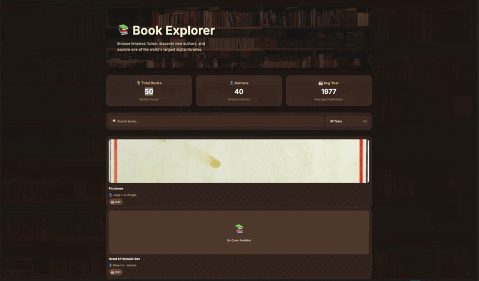

# Web Development Project 5 - Book Dashboard

Submitted by: Hina Sadiq

This web app: A Book Dashboard that allows users to explore book data fetched from a public API. Users can search for books, filter by categories, and view summary statistics about the available books.

Time spent: X hours spent in total

## Required Features

The following required functionality is completed:

- [x] **The site has a dashboard displaying a list of data fetched using an API call**
  - The dashboard displays 10+ unique books, one per row
  - Each book displays features such as title, author, publication year, and category

- [x] **`useEffect` React hook and `async`/`await` are used**
  - API data is fetched when the dashboard loads using React hooks

- [x] **The app dashboard includes at least three summary statistics about the data**
  - Total number of books displayed
  - Total number of authors
  - Average publication year

- [x] **A search bar allows the user to search for an item in the fetched data**
  - Users can search books by title
  - Results update dynamically as the user types

- [x] **An additional filter allows the user to restrict displayed items by specified categories**
  - Users can filter books by category/genre
  - The filter uses a different attribute than the search bar
  - Results update dynamically when the filter changes

## The following optional features are implemented:

- [x] Multiple filters can be applied simultaneously
- [x] Filters use different input types
  - Search text input
  - Category dropdown

- [ ] The user can enter specific bounds for filter values

## The following additional features are implemented:

- [x] Responsive dashboard design
- [x] Book cover images
- [x] Loading state while fetching API data
- [x] No results message when searches return no books

## Video Walkthrough

Here's a walkthrough of implemented user stories:

GIF created with Kap

## Notes

Describe any challenges encountered while building the app.

Example:
The main challenges were working with API data, organizing the book information into reusable React components, and implementing search/filter functionality.

## License

Copyright [2026] Hina Sadiq

Licensed under the Apache License, Version 2.0